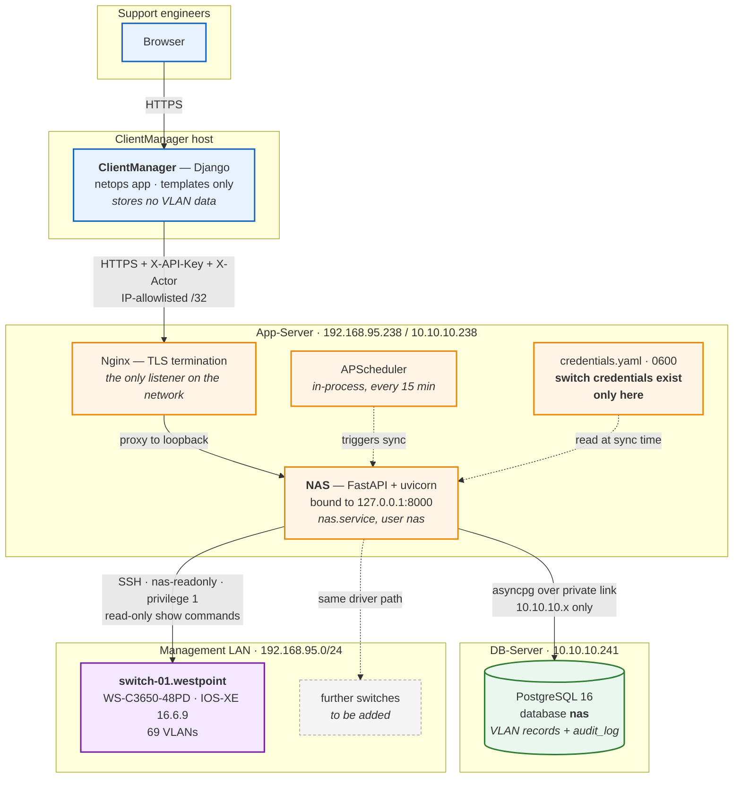
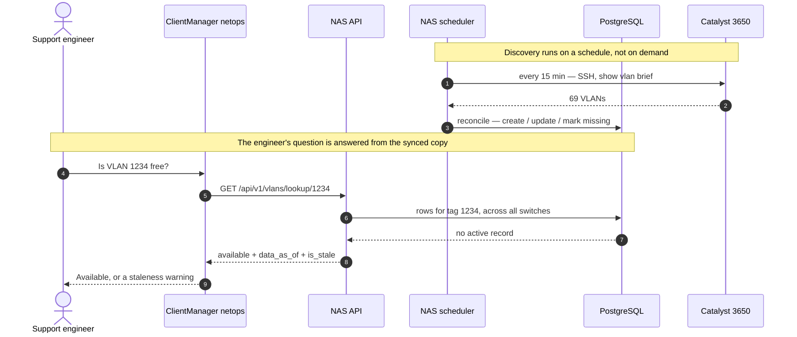

# Architecture

## Deployment topology

The production setup at Westpoint. Every address here is real.



**The orange boundary is the point of the design.** Everything that can reach a switch
lives inside App-Server. ClientManager is internet-adjacent with a large attack surface —
sessions, uploads, email, many user roles — while NAS is a small single-purpose service on
a private network behind an IP allowlist and scoped API keys. A ClientManager compromise
does not become a network compromise.

Four details the diagram encodes deliberately:

- **NAS binds loopback only.** Nothing on the network reaches uvicorn directly; Nginx on
  the same host terminates TLS and proxies to `127.0.0.1:8000`. Set
  `NAS_TRUST_PROXY_HEADERS=true` only once Nginx is actually in front — before that,
  `X-Forwarded-For` is spoofable past the IP allowlist.
- **Two separate networks.** Database traffic uses the private `10.10.10.x` link; the
  switch is reached over the management LAN. PostgreSQL is bound to the private interface
  only and refuses connections on `192.168.95.x`.
- **ClientManager stores nothing.** The `netops` app has no models and no migrations.
  Every VLAN shown in the UI is fetched from the NAS API at request time, so there is one
  source of truth.
- **Adding a switch is inventory, not code.** Further devices join through the same driver
  path — `nas switch add`, a credential ref, and the next scheduled run picks them up.

Both the current staging state and how to work on it locally are in
[deployment.md](deployment.md), which is the right place for the SSH tunnel, the dev
database on port 5434, and everything else that is not production.

## What a VLAN lookup actually does



The lookup **never touches a switch**. It answers from the synchronised copy, which is why
the response carries `data_as_of` and `is_stale`: the switches remain authoritative, and the
UI has to say when the cached answer should not be trusted.

## Layers

```
                 ┌─────────────────────────────────────────────┐
   inbound  ──►  │  api/          routers, DTOs, deps          │   HTTP concerns only
                 ├─────────────────────────────────────────────┤
                 │  services/     use-cases, orchestration     │   business rules
                 ├─────────────────────────────────────────────┤
                 │  repositories/ data access behind Protocols  │   persistence
                 │  drivers/      device access (Milestone 2)   │   device I/O
                 ├─────────────────────────────────────────────┤
                 │  domain/       entities, enums, pagination   │   pure, zero imports out
                 └─────────────────────────────────────────────┘
   cross-cutting: core/ (config, logging, errors, security, credentials, middleware)
```

**The dependency rule: imports point inward only.** `domain` imports nothing from `api`,
`services`, `repositories`, `db` or `core`. `services` depend on repository *Protocols*, not
on SQLAlchemy.

This is not decoration. Two concrete payoffs:

1. **The whole API surface is tested without a database.** `tests/api/` overrides the
   repository dependencies with in-memory fakes and exercises real routing, real middleware,
   real auth and real error handlers. 138 API tests, no PostgreSQL.
2. **Business rules are testable without a switch.** The reconciliation logic
   (created / updated / marked-missing) is pure functions over domain objects, tested
   deterministically in CI where no device is reachable.

The one place this is *not* enough: `AuditService` commits on its own session so an audit entry
survives a request that rolls back, and no in-memory fake has a transaction to demonstrate that.
It is covered in `tests/integration/` instead.

### Where each layer's code lives

| Layer | Module | Responsibility |
|---|---|---|
| API | `api/v1/switches.py` | Route definitions, query validation, scope declaration |
| API | `api/v1/schemas.py` | Response DTOs — the public contract |
| API | `api/deps.py` | The only place outer layers are assembled |
| API | `api/health.py` | Liveness, readiness, health |
| Service | `services/switches.py` | Switch inventory use-cases, credential status derivation |
| Service | `services/auth.py` | Key authentication, scope authorisation |
| Service | `services/audit.py` | Appending the audit trail; actor sanitisation |
| Repository | `repositories/protocols.py` | Interfaces + filter/input DTOs |
| Repository | `repositories/switches.py`, `api_keys.py`, `audit.py` | SQLAlchemy implementations |
| Domain | `domain/entities.py` | `Switch`, `ApiKey`, `AuditEntry` — immutable, framework-free |
| Domain | `domain/enums.py` | `Vendor`, `CredentialStatus`, `ReachabilityState` |
| Domain | `domain/pagination.py` | `PageRequest`, `Page[T]` |
| Core | `core/config.py` | Settings, boot-time hardening checks |
| Core | `core/credentials.py` | `CredentialProvider` protocol + file implementation |
| Core | `core/security.py` | Key generation, hashing, scopes |
| Core | `core/errors.py` | Error hierarchy + the single response envelope |
| Core | `core/middleware.py` | Request context, IP allowlist, security headers |
| Core | `core/logging.py` | structlog JSON configuration |

## Request flow

A `GET /api/v1/switches` call, in order:

```
1. RequestContextMiddleware   assign/propagate request id, bind log context, start timer
2. IpAllowlistMiddleware      reject if source IP is outside the allowlist       → 403
3. SecurityHeadersMiddleware  (applies headers on the way out)
4. require_scopes dependency  authenticate X-API-Key                             → 401
                              authorise required scopes                          → 403
5. get_session dependency     open one session / one transaction
6. SwitchService              query via repository, derive credential_status
7. SwitchResponse.from_view   map domain → DTO
8. commit, log request_completed with status and duration
```

Middleware order matters and is deliberate. Starlette applies middleware in reverse
registration order, so `RequestContextMiddleware` is registered last to run **first** — which
means an IP rejection is still logged with a correlation id and still returns a request id to
the caller.

Note that the IP check precedes authentication. A caller from a disallowed address gets a
`403` regardless of what key it presents, so it cannot use the API to probe key validity.

## Error handling

One envelope, always:

```json
{"error": {"code": "SWITCH_NOT_FOUND", "message": "...", "request_id": "...", "details": {}}}
```

Four handlers in `core/errors.py` cover every path: `AppError` (deliberate failures),
`RequestValidationError` (422), `StarletteHTTPException` (404 on unknown routes, 405), and a
catch-all `Exception` handler. The catch-all logs a full stack trace but returns a generic
`INTERNAL_ERROR` — implementation details never cross the trust boundary.

Validation errors report the offending field's *location and type* but strip Pydantic's
`input` value, so a malformed secret in a request is never echoed back or logged.

## Configuration

`core/config.py` is a frozen `pydantic-settings` model, `NAS_`-prefixed, parsed once and
cached. It performs **boot-time hardening**: in `staging` or `production`, an empty IP
allowlist raises at startup rather than starting a service that silently exposes the only
component with switch access. Failing loudly at boot beats failing quietly in production.

## Observability

Structured JSON logs via structlog, one object per line. Every record carries `timestamp`,
`level`, `logger`, `service`, and inside a request also `request_id`, `client_ip`, `method`,
`path` and — once authenticated — `api_key_id`. stdlib loggers (uvicorn, SQLAlchemy, Alembic)
are routed through the same formatter so the stream stays uniformly parseable by Loki.

An inbound `X-Request-ID` is honoured and echoed back, so a correlation id set by ClientManager
traces a request across both services. Inbound values are length-capped and character-filtered
before use — they land in log records, so they are treated as untrusted input.

Three probes, because they answer different questions: `/live` (process up — restart if
failing), `/ready` (can serve traffic, checks the database — de-pool but do not restart),
`/health` (human/monitoring summary). All three are unauthenticated and exempt from the IP
allowlist so probes need no whitelisting; they expose no switch, customer or credential data.

## Extension points

Adding capability should mean adding a file, not editing the core.

| To add | Do this | Nothing else changes |
|---|---|---|
| A vendor | Implement the driver Protocol, register it (Milestone 2) | Sync engine, API, schema |
| An endpoint | New router module, include it in `api/v1/router.py` | — |
| A secret backend | New `CredentialProvider` implementation + factory line | Drivers, services |
| An API version | New `api/v2/` package under a new prefix | v1 keeps working |
| A persistence change | New repository implementation behind the same Protocol | Services, API |

## What Milestone 2 adds

`vlans`, `vlan_interfaces`, `sync_runs` and `sync_run_switches` tables; a `drivers/` package
with a `NetworkDeviceDriver` Protocol plus Juniper (PyEZ) and mock implementations; a
reconciliation engine with soft-delete; APScheduler plus a CLI entrypoint sharing one service
layer; and the `/vlans`, `/vlans/lookup/{vlan_id}`, `/sync` and `/sync/status` endpoints.

The layering above was chosen so that none of that requires restructuring what exists.

---

## Milestone 2 layers

```
drivers/                     device-facing, vendor-specific
├── base.py                  Protocol + normalised DTOs. Imports no vendor library
├── juniper.py               PyEZ/NETCONF I/O
├── juniper_parser.py        pure XML -> DTO. No PyEZ import, no I/O
├── mock.py                  deterministic in-memory device
└── registry.py              Vendor -> driver. The only file a new vendor touches

sync/reconciler.py           pure diffing. No I/O, no ORM, no driver
services/sync.py             orchestration: lock, per-switch transactions, attribution
services/vlans.py            queries + derived availability verdict
scheduler/runner.py          APScheduler; decides *when*, never *how*
db/locks.py                  advisory lock primitive
```

### Where the safety properties live

The milestone's destructive failure mode is "mark VLANs missing when we simply could not read
the switch". Three separate layers make that hard:

1. **`services/sync.py`** only calls the reconciler *after* `get_vlans()` returns. Any
   `DriverError` jumps straight to recording a failure, so an unreadable switch produces no plan
   at all. This is structural, not a conditional that could be edited away.
2. **`sync/reconciler.py`** refuses to build a plan that would mark *every* active VLAN missing
   because the device reported none — far more likely a silent read failure than a mass deletion.
   Overridable via `NAS_SYNC_ALLOW_EMPTY_DISCOVERY`.
3. **`drivers/base.py`** documents `get_vlans()` as "complete set or raise". A driver returning a
   partial list would look like deletions, so partial returns are a contract violation.

### Why the parser is a separate pure module

`juniper_parser.py` takes XML text and returns DTOs. No PyEZ, no sockets. That makes the riskiest
part of the Juniper integration — reading real device output across Junos versions — testable
against recorded fixtures on a laptop and in CI, with the optional dependency absent.

### Transaction shape

**One transaction per switch, not per run.** A run that fails on switch four keeps the work done
for switches one to three. Combined with `sync_run_switches` rows, a partial run is both durable
and explainable. The advisory lock is held on its own connection for the whole run while each
switch commits independently.

### Why PyEZ is dispatched to a thread

PyEZ is synchronous. Every call goes through `anyio.to_thread.run_sync`; blocking the event loop
would stall every in-flight HTTP request while a switch is polled. Switches are polled
concurrently, bounded by `NAS_SYNC_MAX_CONCURRENCY`.

---

## Drivers as of the Cisco work

```
drivers/
├── base.py                    Protocol + normalised DTOs. Imports no vendor library
├── options.py                 DriverOptions — timeouts and transport config
├── registry.py                Vendor -> driver. The only file a new platform touches
│
├── cisco_iosxe.py             SSH CLI via netmiko (thread-offloaded)
├── cisco_iosxe_parser.py      pure: show vlan brief / ip int brief -> DTOs
├── cisco_nxos.py              NX-API JSON over HTTPS via httpx (natively async)
├── cisco_nxos_parser.py       pure: NX-OS JSON -> DTOs
├── juniper.py                 NETCONF via PyEZ (thread-offloaded)
├── juniper_parser.py          pure: Junos XML -> DTOs
└── mock.py                    deterministic in-memory device
```

| Platform | Transport | Structured? | Optional extra | Blocking? |
|---|---|---|---|---|
| Nexus 9000 (`cisco_nxos`) | NX-API, JSON/HTTPS :443 | Yes, natively | none (`httpx` is core) | No — async |
| Catalyst (`cisco_iosxe`) | SSH CLI :22 | No, parsed | `[cisco]` → netmiko | Yes — threaded |
| Juniper (`juniper`) | NETCONF :22 | Yes, XML | `[juniper]` → PyEZ | Yes — threaded |
| Mock (`mock`) | none | Yes | none | No |

### The pattern every driver follows

**One I/O module plus one pure parser.** The parser takes bytes or a payload and
returns DTOs, importing no vendor library. That is what makes the riskiest part of
each integration — reading real device output across firmware versions — testable
against recorded fixtures, on a laptop, in CI, with the optional dependency absent.

It is also why the whole test suite runs with neither netmiko nor PyEZ installed.

### Where transport differences are absorbed

The `NetworkDeviceDriver` Protocol is deliberately transport-agnostic: `connect`,
`close`, `get_facts`, `get_vlans`. Nothing in it implies SSH. That is why NX-API over
HTTPS slotted in beside two SSH drivers without touching the interface — and why the
`port` column needed no new semantics, only different values (443 for Nexus).

### Enrichment is best-effort; discovery is not

Each Cisco driver makes one **mandatory** call (`show vlan …`) and one or two
**optional** ones:

* IOS-XE: `show ip interface brief` → SVI, for `l3_interface`
* NX-OS: `show interface brief` → SVI; `show running-config vlan` → `vn-segment`

If an optional call fails — a restricted role, a feature not enabled — the switch
still syncs, just with less detail. If the mandatory call fails, the driver raises
and the reconciler is never reached. This split is what keeps a
`network-operator`-only account from being treated as an unreadable switch.
